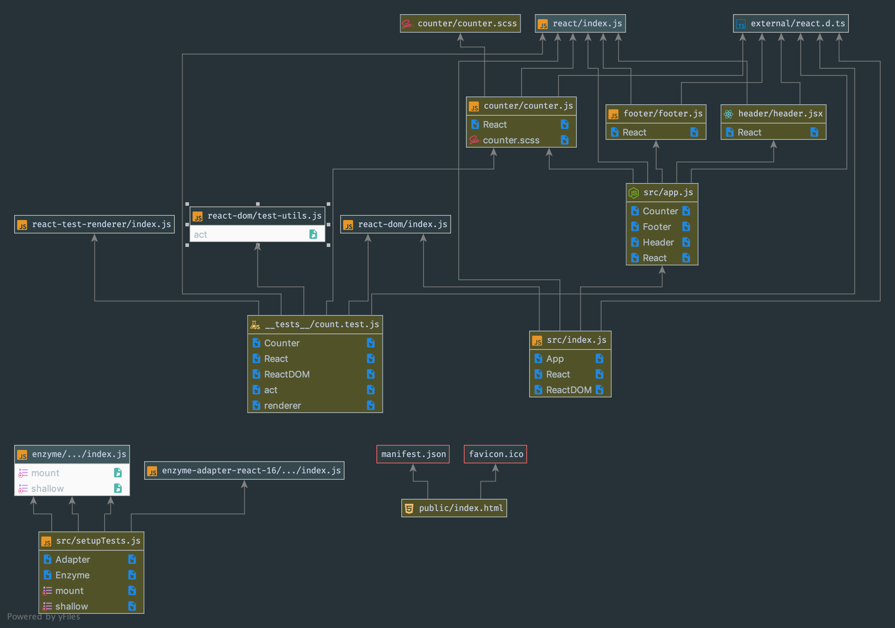

# LAB - 18

 ## ACL

 ### Author: Evan Brecht-Curry

 ### Links and Resources
* [submission PR](https://github.com/evan-401-advanced-javascript/lab-18-acl/pull/1)
* [travis](https://www.travis-ci.com/evan-401-advanced-javascript/lab-18-acl)
* [netlify](https://kind-leavitt-e48f4e.netlify.com) 
* [S3](http://lab-27-react-testing-9-17.s3-website-us-west-2.amazonaws.com/) 
* [docs](http://localhost:3000/docs/)

 ##### Exported Values and Methods

### Setup

#### `.env` requirements

 #### UML
